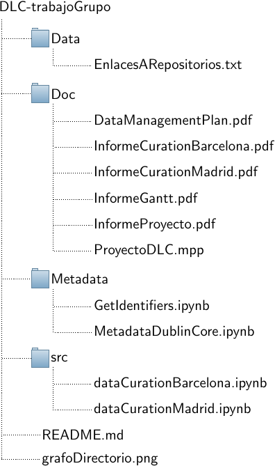

# Calidad del aire y tráfico en Madrid y Barcelona

### Integrantes: 

Álvaro Ibrain Rodríguez
Elsa Cerezo Fernández
Julia Ruiz Salmón
Miguel Traspuesto Abascal
Miguel Carlos Blanco Cacharrón
Razván Pascal

### Descripción

Este repositorio contiene los enlaces a repositorios de datos (carpeta Data), metadatos (carpeta Metadata), documentos (carpeta Doc) y código (carpeta Src) utilizados en el desarrollo del proyecto del análisis de la calidad del aire de Madrid y Barcelona. A continuación, se muestra una imagen del contenido estructurado del repositorio:

